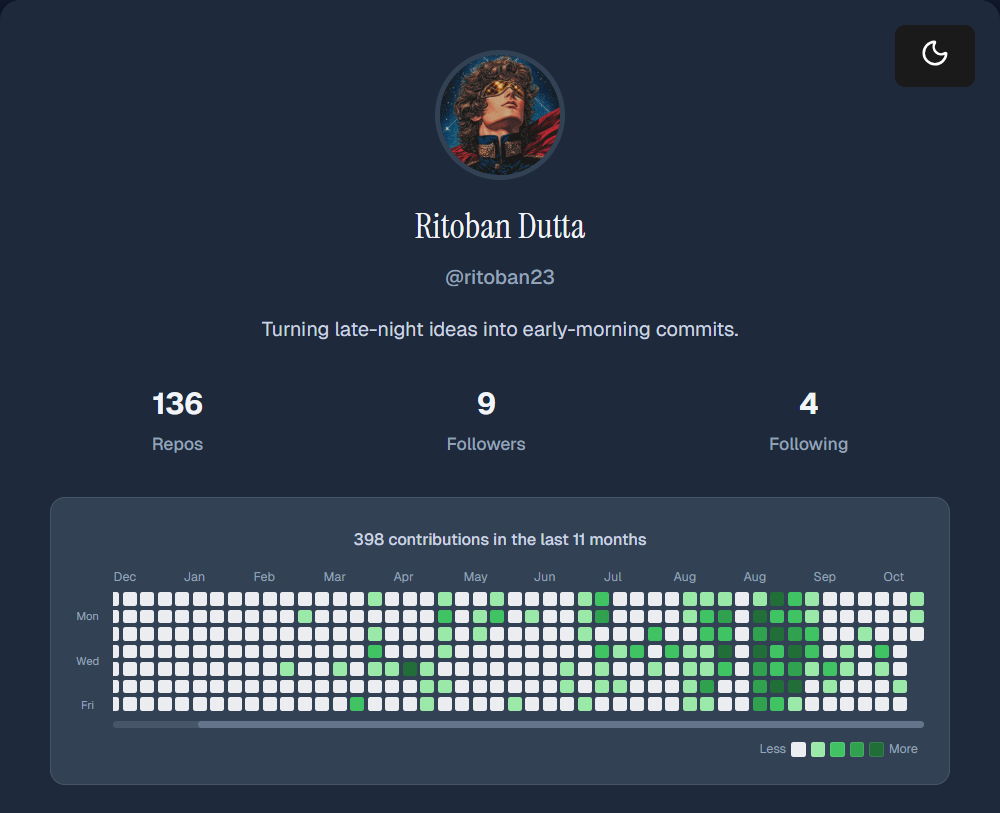
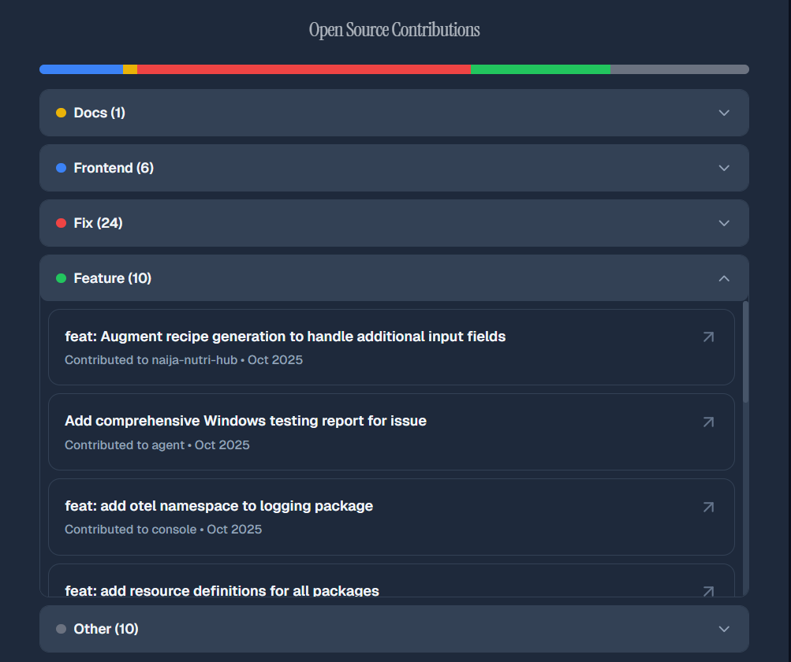

# gh-showcase

[](https://www.npmjs.com/package/gh-showcase)
[](https://github.com/ritoban23/gh-showcase)

- A beautiful React component to showcase GitHub profiles with bio, contribution graphs, categorized pull requests, dark mode support, and other stats—perfect for portfolios and documentation sites.
- Help recruiters discover your best work effortlessly—no need for them to dig through your GitHub profile, and no worries about whether they'll find your most impressive contributions.

## 📦 Installation

```bash
npm install gh-showcase
```

## 🚀 Usage

```jsx
import { Showcase } from 'gh-showcase';
import 'gh-showcase/style.css';

function App() {
  return <Showcase username="your-github-username" />;
}
```

## ✨ Features

- **Profile Card** - Avatar, name, bio, and GitHub stats
- **PR Breakdown** - Categorized merged PRs (Frontend, Docs, Fix, Feature, Other)
- **Contribution Graph** - GitHub activity visualization
- **Theme Toggle** - Dark/light mode with smooth transitions
- **Responsive Design** - Works on all screen sizes
- **TypeScript Support** - Fully typed

## 🖼️ Showcase

See how `gh-showcase` looks in a real portfolio:





## 🔗 Links

- [npm Package](https://www.npmjs.com/package/gh-showcase)
- [GitHub Repository](https://github.com/ritoban23/gh-showcase)

---

## 🛠️ Technical Implementation

### Custom Hooks

#### `useGitHubProfile(username: string)`
- Fetches user profile from GitHub API
- Returns: `{ user, loading, error }`
- Handles empty username and HTTP errors
- TypeScript interface: `GitHubUser`

#### `useGitHubPRs(username: string)`
- Fetches up to 100 PRs using GitHub Search API
- Classifies each PR using keyword matching
- Returns: `{ totalPRs, breakdown, categorizedPRs, loading, error }`
- TypeScript interfaces: `PRBreakdown`, `CategorizedPRs`, `GitHubPR`

### Components

#### `Showcase`
- **Props**: `username` (required), `theme` (optional, defaults to 'light')
- Displays complete GitHub profile card
- Integrates PR breakdown visualization
- Responsive design with CSS modules

#### `PRBreakdown`
- **Props**: `username` (required)
- Interactive accordion interface
- Color-coded categories (Blue, Yellow, Red, Green, Gray)
- Scrollable PR lists with max-height constraint
- Hover effects on PR cards

---

## 📊 How It Works

1. **Profile Fetch**: Component fetches user data from `https://api.github.com/users/{username}`
2. **PR Search**: Simultaneously fetches PRs from `https://api.github.com/search/issues?q=author:{username}+type:pr&per_page=100`
3. **Classification**: Each PR's title and body are analyzed using regex patterns
4. **Visualization**: 
   - Progress bar shows percentage distribution
   - Accordion shows detailed PR list per category
5. **Interaction**: Click any category to expand and view all PRs, click PR cards to open on GitHub

---

## 🔧 Technologies Used

- **React 18** with TypeScript
- **Vite** for fast development and building
- **CSS Modules** for component-scoped styling
- **GitHub REST API** for data fetching
- **ES6+ Features**: Hooks, async/await, fetch API

---

## 📝 Development Timeline

### Session 1: Foundation
- ✅ Created project structure with `lib/` folder inside `src/`
- ✅ Built `useGitHubProfile` hook with TypeScript interfaces
- ✅ Created test component in `App.tsx`
- ✅ Verified data fetching with JSON display

### Session 2: UI Components
- ✅ Built `Showcase` component with profile card design
- ✅ Created `Showcase.module.css` with modern styling
- ✅ Integrated profile data into visual card layout
- ✅ Added stats display and profile link button

### Session 3: PR Analytics
- ✅ Built `useGitHubPRs` hook with classification logic
- ✅ Created `PRBreakdown` component with progress bar
- ✅ Implemented accordion interface for PR categories
- ✅ Added PR cards with links and metadata
- ✅ Styled with `PRBreakdown.module.css`
- ✅ Integrated PR breakdown into main Showcase card

### Session 4: Bug Fixes & Documentation
- ✅ Fixed syntax errors in `useGitHubPRs.ts`
- ✅ Resolved duplicate state declarations
- ✅ Corrected corrupted code sections
- ✅ Created comprehensive README documentation

---

## 🎯 Current Status

**Fully functional library** with:
- ✅ Complete GitHub profile display
- ✅ Interactive PR categorization and visualization
- ✅ Accordion-style expandable categories
- ✅ Direct links to all PRs
- ✅ Clean, modern UI
- ✅ TypeScript type safety
- ✅ Error handling and loading states

---

## 🚀 Next Steps (Potential Enhancements)

- [ ] Implement search/filter within PR lists
- [ ] Add more PR metadata (status, labels, comments)
- [ ] Add unit tests
- [ ] Support for organizations/teams
- [ ] Caching to reduce API calls
- [ ] Customizable color schemes

---

## 📄 License

MIT License - Feel free to use and modify!

---

**Built with ❤️**
